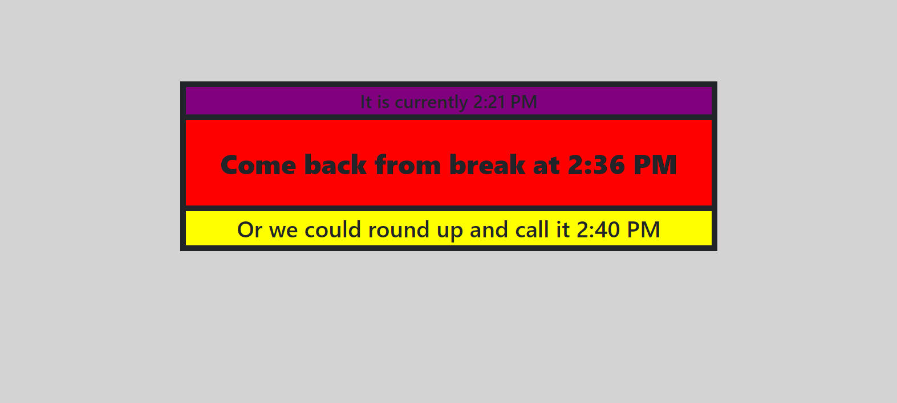

# break-calculator

## Description

In order to help users that struggle adding 15 minutes to the current time and help suggest a more convenient time to reconvine, this program was created with the intention to solve both of these problems.

## Usage

Deployed Website: https://afontana405.github.io/break-calculator/
## Credits

While all the coding can be traced back to me, I must acknowledge that I would have never had started this project if it were not for my instructor's inabilty to add 15 minutes to the current time. -- The Shade !!!!!!!!!

## License

Please refer to the LICENSE in the repo.
